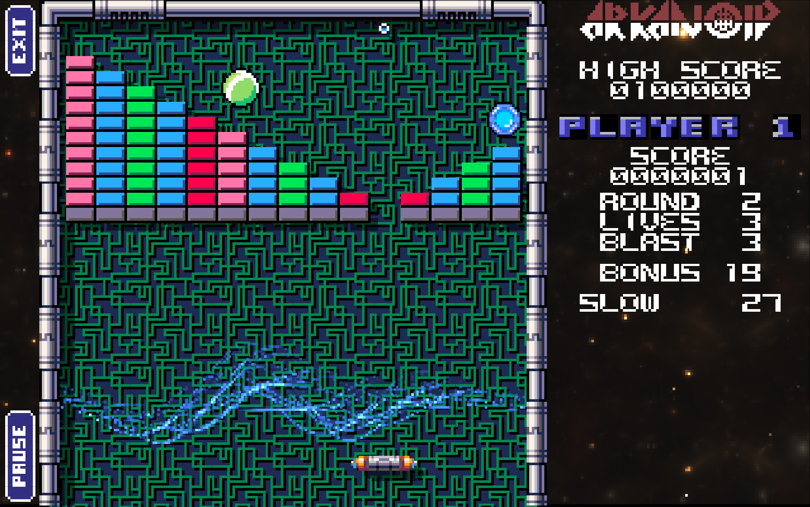
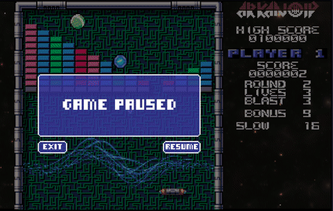

### flutternoid

Found some lovely Pico-8 Arkanoid Clone assets on itch.io:

https://kronbits.itch.io/matriax-free-assets

Haven't done an Arkanoid/BreakOut clone in a while.

So here is one more...

### To Do

There are a few bugs with the ball and enemies. Not really game breaking. You can always just quit and restart at the
same level.

### Credits

#### Graphics

* Game graphics by @Davitmasia: kronbits.itch.io/matriax-free-assets
* Title screen background by Jones (Imagine / Taito)
* Scoreboard logo by Mark Jones (Imagine / Taito)

#### Shaders

* Wave by scarletshark: shadertoy.com/view/ltXczj
* Pixel explosion by Leukbaars: shadertoy.com/view/lldGzr
* Star nest by Pablo Roman Andrioli: shadertoy.com/view/XlfGRj
* Plasma globe by nimitz: shadertoy.com/view/XsjXRm

#### Music

* Title theme by suno.com: suno.com/song/b716462a-987b-4de2-8ce5-314ebc7c0a4a
* Game theme by suno.com, too.

#### Code

* Flame Game Engine: flame-engine.org
* Audio Streaming Engine: github.com/reki2000/mp-audio-stream

### Playable Web Version

https://intensicode.github.io/flutternoid/

### Screenshots

### To Do

- [ ] BUG: game completed + ball lost or killed => game not completed OMG
- [ ] BUG: game completed state not cleared after hiscore

- [ ] PERF: web performance became bad suddenly - why?

- [ ] BUG: extras collected when player destroyed
- [ ] BUG: multi ball after destroyed is still around
- [ ] BUG: enemies are invisible at (0,0) when spawning - ball sometimes hits them
- [ ] BUG: audio switching messed up - music does not turn on sometimes?
- [ ] BUG: rarely ball with zero x or y speed but no auto speed up?
- [ ] BUG: plasma appears in center(?) when certain(?) multi ball state?
- [ ] BUG: disable pause when level complete (or other overlay active)

- [ ] doors should be considered blocked if enemy is blocking it ^^
- [ ] make vaus pull ball back from void a bit more?
- [ ] make vaus move one or two pixels more towards the walls?
- [ ] fix min ball speed (in upper part)
- [ ] separate options from configuration
- [ ] shader fix for desktop?
- [ ] shader for tiled background? or render into an image once?
- [ ] level defines enemies
- [ ] limit enemy speed
- [ ] forge2D only inside GameScreen? switch world when in GameController?
- [ ] pause physics via HasTimeScale on Forge2dWorld?
- [ ] pause physics via custom Forge2DWorld not calling update when paused?
- [ ] UNLOCK extra levels from ROD with new molecule enemy, reappearing and moving blocks

- [-] BUG: fix random block selection to not pick first block every time [seems to work after all]
- [-] BUG: last extra is cut off [cannot reproduce]
- [-] soLoud + audio_players for Web? [soloud breaks web build]
- [X] BUG: ball jumps behind wall - make wall a solid box?
- [X] BUG: count down level time in bonus screen
- [X] BUG: door stays open?
- [X] BUG: enemy bonus broken? because of the doh handling changes?
- [X] BUG: enter hiscore after game over not working (unless eog)
- [X] BUG: extra life broken?
- [X] BUG: frame shadow and slow down over vaus?
- [X] BUG: vaus explodes multiple times if enemies hit in short sequence
- [X] README with screenshots and animated gif
- [X] SHOW HOW TO PLAY AT FIRST START
- [X] audio_players for Web?
- [X] ball lost -> new ball (and live lost? or just enemies?)
- [X] bonus screen in next round
- [X] count down bonus point in bonus screen
- [X] count remaining blasts at end of game as score x 3333
- [X] count remaining lives at end of game as score x 1000
- [X] doh level
- [X] doh scoring
- [X] enemies after vaus lost?
- [X] extras by brick color?
- [X] fade in background music when audio mode with music selected
- [X] fade out title music when leaving title
- [X] game complete message / scene / handling
- [X] hiscore entry
- [X] hiscore rename
- [X] laugh when last level starts
- [X] level complete
- [X] level defines spawn mode: none vs random vs defined_only
- [X] level start 'Round X'
- [X] level time
- [X] level time -> time bonus
- [X] limit laser time and shots
- [X] note playing
- [X] notes as samples?
- [X] persist audio choice
- [X] persist game state (level, score, lives, ... only)
- [X] persist video choice
- [X] play hiscore sound - for every ranked step plus hiscore
- [X] player moves in new level? because of keys not cleared? or velocity?
- [X] proper reset for new level: player, ball, etc GameObject after all?
- [X] resume vs new game
- [X] scoreboard
- [X] shortcuts only when "active"
- [X] show rank after RANKED #<x>
- [X] show status
- [X] use game phase for reset? or map round_intro to reset message?
- [X] volume
